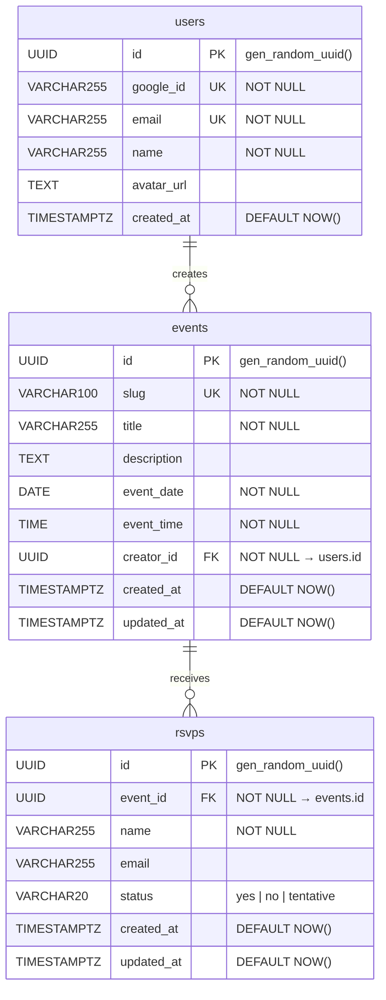

# ERD — EventPing

Entity-relationship diagram for the EventPing PostgreSQL database.

## Diagram



## Constraints

| Table  | Constraint                                  | Type              |
|--------|---------------------------------------------|-------------------|
| users  | `uq_users_google_id`                        | UNIQUE            |
| users  | `uq_users_email`                            | UNIQUE            |
| events | `uq_events_slug`                            | UNIQUE            |
| events | `fk_events_creator_id → users.id`           | FK + CASCADE DEL  |
| rsvps  | `fk_rsvps_event_id → events.id`             | FK + CASCADE DEL  |
| rsvps  | `uq_rsvp_event_email (event_id, email)`     | UNIQUE NULLS NOT DISTINCT |
| rsvps  | `chk_rsvps_status IN ('yes','no','tentative')` | CHECK          |

## Indexes

| Index                | Table  | Column(s)  | Purpose                               |
|----------------------|--------|------------|---------------------------------------|
| `idx_events_slug`    | events | slug       | Fast lookup by public event URL       |
| `idx_events_creator` | events | creator_id | List events by authenticated user     |
| `idx_rsvps_event`    | rsvps  | event_id   | Aggregate/list RSVPs for an event     |

## Migration Strategy

**Tool:** [Drizzle Kit](https://orm.drizzle.team/docs/migrations)

### Why Drizzle Kit?
- TypeScript-first schema definition (`backend/src/db/schema.ts`) — single source of truth
- Auto-generates timestamped migration SQL from schema diffs
- Supports both up and rollback scripts
- Lightweight: no runtime ORM overhead if using raw `pg` queries alongside

### Workflow

```
# 1. Edit schema
backend/src/db/schema.ts

# 2. Generate migration SQL
npx drizzle-kit generate

# 3. Review generated file
database/migrations/XXXX_<description>.sql

# 4. Apply to target environment
npx drizzle-kit migrate
```

### File layout

```
database/
├── migrations/
│   └── 0001_initial_schema.sql    # generated by Drizzle Kit
├── schema/
│   ├── schema.sql                 # canonical DDL (this repo)
│   └── ERD.md                     # this file
└── seeds/
    └── dev.sql                    # development fixtures
```

### Environment matrix

| Environment | Database                          | Migration trigger          |
|-------------|-----------------------------------|----------------------------|
| development | Docker PostgreSQL (local)         | Manual: `drizzle-kit migrate` |
| staging     | Azure Flexible Server             | Automatic via GitHub Actions CD |
| production  | Azure Flexible Server             | Manual promotion after Phase 9 approval |

### Rollback

Each generated migration file contains a `-- down` section. To roll back:

```sql
-- run the down section of the target migration file
```

In production, always take a snapshot of the Flexible Server before applying migrations.
